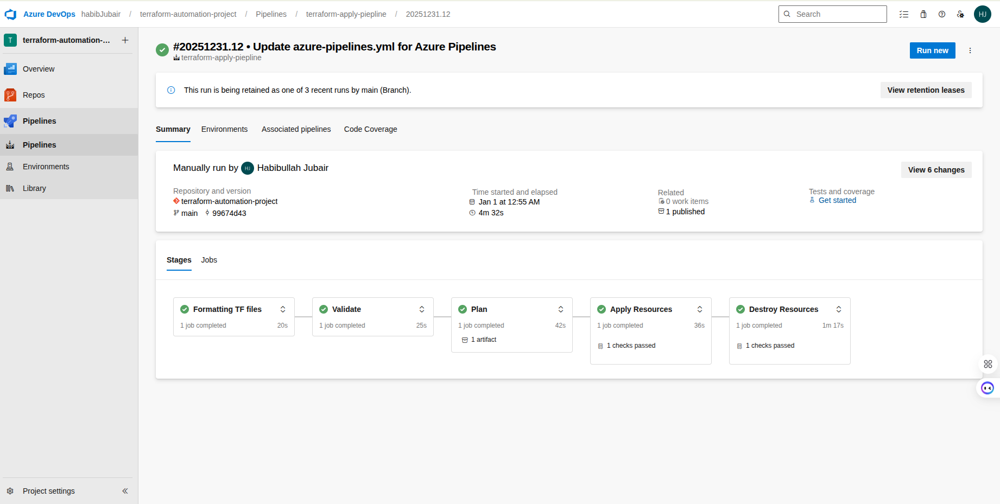

# Azure Infrastructure as Code - Production-Ready Deployment

A comprehensive Terraform-based Infrastructure as Code (IaC) solution for deploying a production-ready Azure cloud infrastructure. This project implements a modular architecture for deploying Azure Kubernetes Service (AKS), Application Gateway, Virtual Machines, and supporting network infrastructure with security best practices.

## Table of Contents

- [Overview](#overview)
- [Architecture](#architecture)
- [Prerequisites](#prerequisites)
- [Project Structure](#project-structure)
- [Modules](#modules)
- [Getting Started](#getting-started)
- [Configuration](#configuration)
- [Deployment](#deployment)
- [CI/CD Pipeline Configuration](#cicd-pipeline-configuration)
- [Security Considerations](#security-considerations)

## Overview

This Terraform project automates the deployment of a complete Azure infrastructure stack, including:

- **Private Azure Kubernetes Service (AKS)** cluster with integrated Application Gateway
- **Application Gateway** for web application firewall and load balancing
- **Virtual Network** with multiple isolated subnets
- **Network Security Groups** with configured security rules
- **Virtual Machines** for application hosting and jumpbox access
- **Azure Container Registry (ACR)** for container image management

The infrastructure is designed following cloud-native best practices with modularity, scalability, and security as core principles.

## Architecture

The solution implements a multi-tier network architecture with dedicated subnets for different components:

- **AKS Subnet**: Dedicated network segment for Kubernetes cluster nodes
- **Application Gateway Subnet**: Isolated subnet for Application Gateway resources
- **VM Subnet**: Network segment for virtual machines and jumpbox access


### Azure DevOps Pipeline

The infrastructure deployment is automated through Azure DevOps CI/CD pipeline:




## Prerequisites

Before deploying this infrastructure, ensure you have the following:

### Required Software

- **Terraform** >= 1.0.0
- **Azure CLI** >= 2.40.0
- **kubectl** (for AKS cluster management)
- **Git** for version control

### Azure Requirements

- Active Azure subscription with appropriate permissions
- Contributor or Owner role on the target subscription
- Service Principal or Managed Identity with required permissions
- Sufficient quota for:
  - Standard D-series virtual machines
  - Azure Kubernetes Service
  - Application Gateway

### Authentication

Authenticate with Azure using one of the following methods:

```bash
# Option 1: Azure CLI login
az login
az account set --subscription "your-subscription-id"

# Option 2: Service Principal
export ARM_CLIENT_ID="your-client-id"
export ARM_CLIENT_SECRET="your-client-secret"
export ARM_SUBSCRIPTION_ID="your-subscription-id"
export ARM_TENANT_ID="your-tenant-id"
```

## Project Structure

```
.
├── modules/
│   ├── AKS-private/          # Private AKS cluster module
│   ├── Application-Gateway/  # Application Gateway module
│   ├── NIC/                  # Network Interface module
│   ├── NSG/                  # Network Security Group module
│   ├── resourceGroup/        # Resource Group module
│   ├── Subnets/              # Subnet module
│   ├── VM/                   # Virtual Machine module
│   └── VNet/                 # Virtual Network module
├── docs/
│   └── images/               # Documentation images
├── infrastructure.tf         # Core infrastructure resources
├── private-aks.tf            # AKS cluster configuration
├── app-gateway.tf            # Application Gateway configuration
├── JumpBox-VM.tf             # Jumpbox VM configuration
├── private-acr.tf            # Container Registry configuration
├── providers.tf              # Terraform provider configuration
├── variables.tf              # Variable definitions
├── terraform.tfvars          # Variable values (not in version control)
└── README.md                 # This file
```

## Modules

- **Resource Group Module** (`modules/resourceGroup/`) - Creates and manages Azure Resource Groups
- **Virtual Network Module** (`modules/VNet/`) - Deploys Azure Virtual Network with configurable address space and DNS servers
- **Subnet Module** (`modules/Subnets/`) - Creates subnets within the Virtual Network with configurable address prefixes
- **Network Security Group Module** (`modules/NSG/`) - Implements network security rules for traffic filtering and access control
- **Network Interface Module** (`modules/NIC/`) - Creates network interfaces for virtual machines with IP configuration
- **Virtual Machine Module** (`modules/VM/`) - Deploys Linux virtual machines with configurable sizes and operating system settings
- **AKS Private Module** (`modules/AKS-private/`) - Deploys a private Azure Kubernetes Service cluster with integrated networking
- **Application Gateway Module** (`modules/Application-Gateway/`) - Deploys Azure Application Gateway with web application firewall capabilities

## Getting Started

### 1. Clone the Repository

```bash
git clone <repository-url>
cd my-terraform-directory
```

### 2. Configure Variables

Copy the example variables file and customize for your environment:

```bash
cp terraform.tfvars.example terraform.tfvars
```

Edit `terraform.tfvars` with your specific values. Important variables include:

- Resource group name and location
- Virtual network address space
- Subnet address prefixes
- VM sizes and configurations
- AKS cluster settings

### 3. Initialize Terraform

```bash
terraform init
```

This command downloads required providers and initializes the backend.

### 4. Review Execution Plan

```bash
terraform plan
```

Review the execution plan to verify the resources that will be created, modified, or destroyed.

### 5. Deploy Infrastructure

```bash
terraform apply
```

Confirm the deployment when prompted. The process may take 15-30 minutes depending on resource provisioning times.

## Configuration

### Key Variables

Edit `terraform.tfvars` to configure your deployment:

```hcl
# Resource Group Configuration
rg_name     = "MyProdResourceGroup"
rg_location = "eastasia"

# Network Configuration
azureVnet_name           = "prod-vnet-1"
vnet_addr_space          = ["10.0.0.0/16"]
vnet_dns_servers         = ["8.8.8.8"]

# Subnet Configuration
aks_subnet_addr_prefix   = ["10.0.1.0/24"]
appgw_subnet_addr_prefix = ["10.0.2.0/24"]
vm_subnet_addr_prefix    = ["10.0.3.0/24"]

# Virtual Machine Configuration
vm_name      = "my-web-server"
vm_size      = "Standard_D2as_v5"
admin_username = "azureuser"
admin_password = "your-secure-password"

# AKS Configuration
aks_name         = "my-private-aks-cluster101"
aks_dns_prefix   = "myprivateaks101"
aks_node_count   = 2
aks_node_vm_size = "Standard_D2s_v3"
aks_environment  = "production"
```

### Variable Descriptions

- **rg_name**: Name of the Azure Resource Group
- **rg_location**: Azure region for resource deployment
- **vnet_addr_space**: CIDR block for the Virtual Network
- **vm_size**: Azure VM size SKU for virtual machines
- **aks_node_count**: Number of nodes in the AKS node pool
- **aks_environment**: Environment tag for resource organization

## Deployment

### Standard Deployment

The standard deployment process creates all resources in the correct order based on dependencies:

1. Resource Group
2. Virtual Network
3. Subnets
4. Network Security Groups
5. Network Interfaces
6. Application Gateway
7. Virtual Machines
8. AKS Cluster

## CI/CD Pipeline Configuration

The infrastructure deployment is automated through Azure DevOps CI/CD pipeline.

### Pipeline Stages

1. **Formatting** - Formats Terraform files
2. **Validate** - Validates Terraform configuration
3. **Plan** - Creates execution plan
4. **Apply** - Deploys infrastructure (requires manual approval via `terraform_apply` environment)
5. **Destroy** - Removes infrastructure (requires manual approval via `terraform_destroy` environment)

### Manual Approval Environments

Two environments require manual approval:
- `terraform_apply` - Approve before applying changes
- `terraform_destroy` - Approve before destroying infrastructure

### Variable Groups

Store sensitive variables (e.g., `admin_password`) in Azure DevOps Variable Groups. Link the Variable Group in pipeline YAML:

```yaml
variables:
  - group: terraform-variables
```

## Security Considerations

### Network Security

- Network Security Groups enforce traffic filtering rules
- Private AKS cluster reduces public exposure
- Subnet isolation separates different workload types
- Application Gateway provides web application firewall protection

## Additional Resources

- [Azure Kubernetes Service Documentation](https://docs.microsoft.com/azure/aks/)
- [Azure Application Gateway Documentation](https://docs.microsoft.com/azure/application-gateway/)
- [Terraform Azure Provider Documentation](https://registry.terraform.io/providers/hashicorp/azurerm/latest/docs)
- [Azure Well-Architected Framework](https://docs.microsoft.com/azure/architecture/framework/)

## Support

For issues, questions, or contributions, please refer to the project repository or contact the infrastructure team.

---

**Last Updated**: 2025  
**Terraform Version**: >= 1.0.0  
**Azure Provider Version**: 4.57.0
